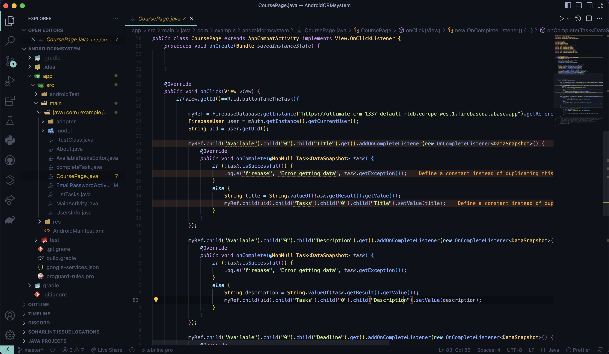
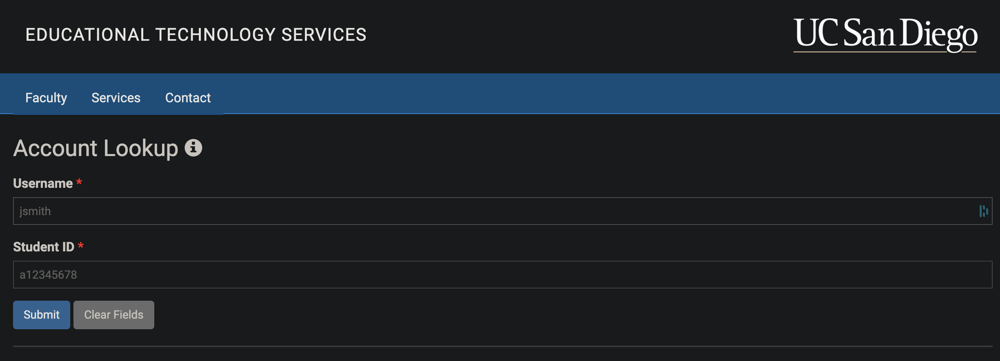

# Lab report 1 - Daniil Katulevskiy

## Installing VSCode:

- Follow link https://code.visualstudio.com/download
- Download and install the binary for your system



## Remotely connecting
- Reset your password via https://sdacs.ucsd.edu/~icc/index.php
- Use your terminal to establish ssh connection ([TUTORIAL](https://youtu.be/in1QMOYk6Io))
- Command: ```ssh username@ieng6.ucsd.edu``` (input your course-specific username)
- Then input your password (it will not show symbols you are typing, this is an intended behavior)



## Trying some commands
- Try out some commands, such as:
    - ```cd /``` (changes directory to root)
    - ```ls -a``` (outputs list of all files in the directory, including hidden files)


