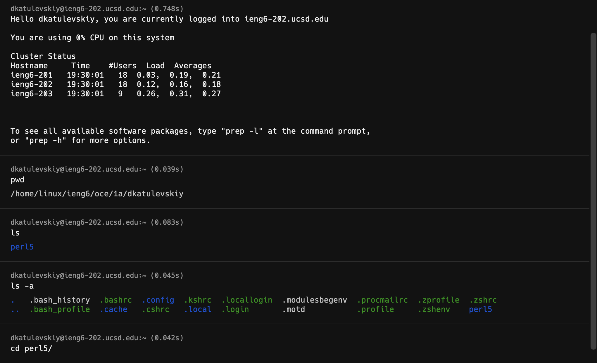

# Lab report 1 - Daniil Katulevskiy

## Installing VSCode:

- Follow link https://code.visualstudio.com/download
- Download and install the binary for your system

## Remotely connecting
- Reset your password via https://sdacs.ucsd.edu/~icc/index.php
- Use your terminal to establish ssh connection ([TUTORIAL](https://youtu.be/in1QMOYk6Io))

## Trying some commands
- Try out some commands, such as:
* cd /
* ls -a

