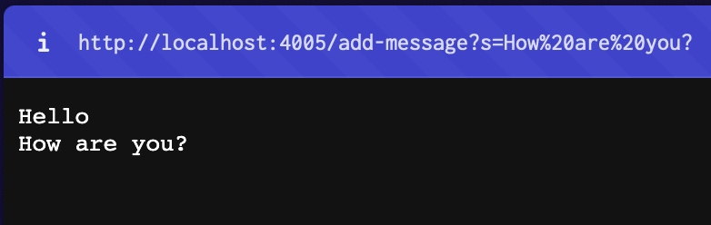
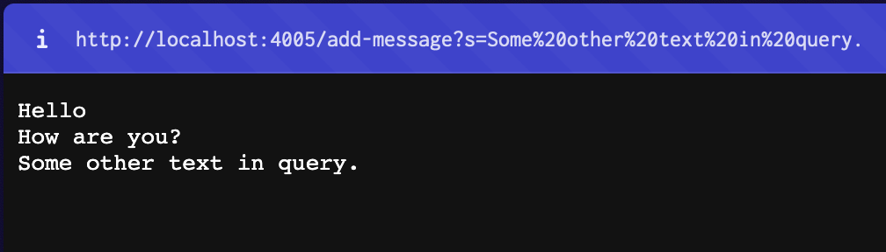
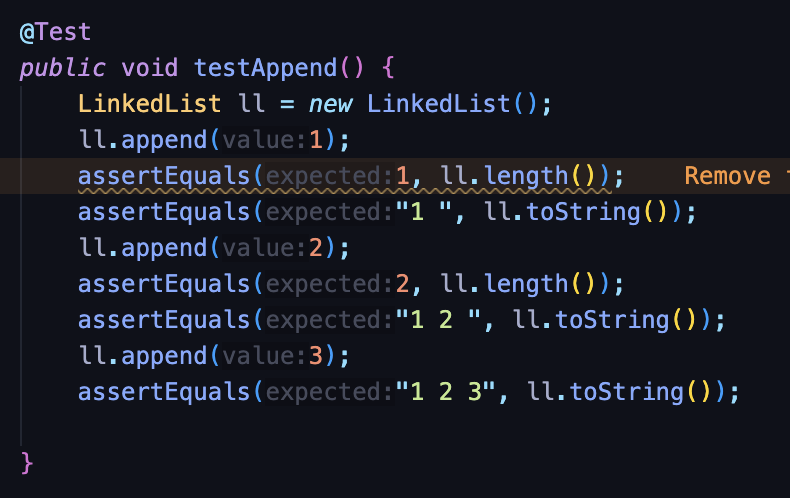
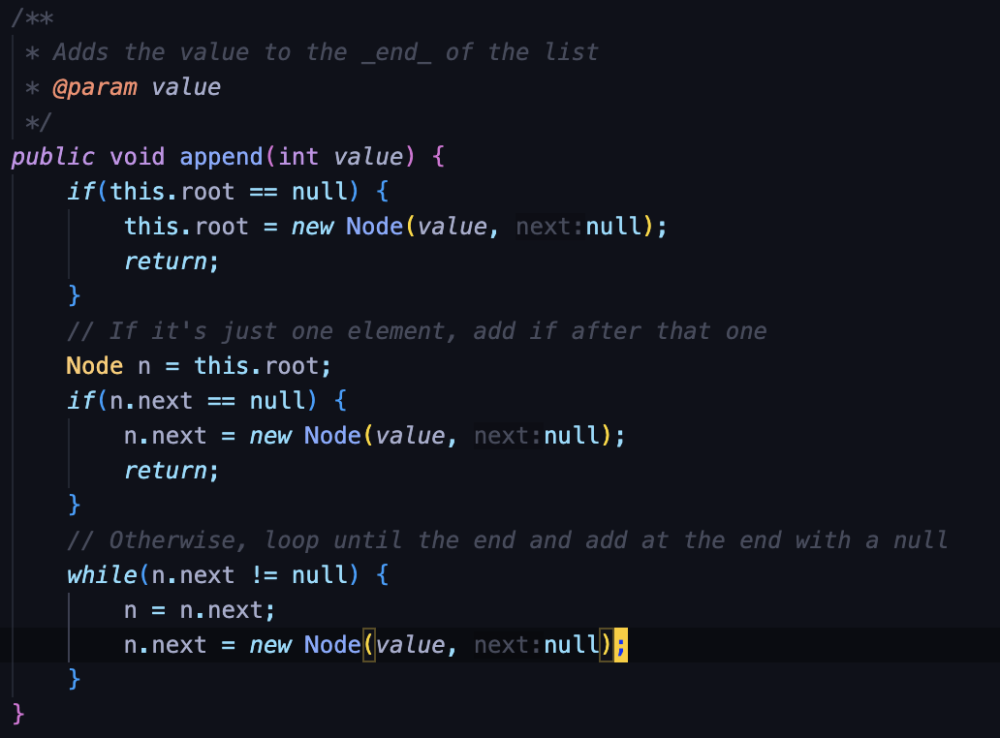
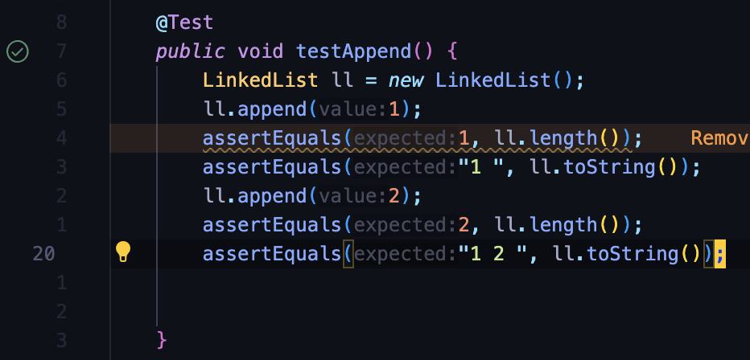

# Lab report 2 - Daniil Katulevskiy A17481234

# Part 1

## Code for StringServer.java

```java
import java.io.IOException;
import java.net.URI;
import java.util.ArrayList;

class StringSearchHandler implements URLHandler {
    // The one bit of state on the server: a number that will be manipulated by
    // various requests.
    ArrayList<String> words = new ArrayList<>();

    public String handleRequest(URI url) {
        if (url.getPath().equals("/")) {
            return "Daniel's search system";

        } else if (url.getPath().equals("/search")) {
            //! SEARCH
            String[] parameters = url.getQuery().split("=");
            if (parameters[0].equals("a")){
                return String.join(", ", words);
            }

            else if (!parameters[0].equals("s")) {
                return "You forgot s= in your request!";
            }

            ArrayList<String> found = new ArrayList<>();
            for (String word : words) {
                if (word.toLowerCase().contains(parameters[1].toLowerCase())) {
                    found.add(word);
                }
            }
            String foundstr = String.join(", ", found);
            return String.format("Results found: %s", foundstr);
        } 

        else if (url.getPath().equals("/add-message")) {
            String[] parameters = url.getQuery().split("=");
                if (parameters[0].equals("s")) {
                    words.add(parameters[1]);
                    String allStr = String.join("\n", words);
                    return allStr;
                }
                return "You forgot s= in your request!";
        }
        
        else {
            System.out.println("Path: " + url.getPath());
            return "404 Not Found!";
        }
    }
}

class StringServer {
    public static void main(String[] args) throws IOException {
        if(args.length == 0){
            System.out.println("Missing port number! Try any number between 1024 to 49151");
            return;
        }

        int port = Integer.parseInt(args[0]);

        Server.start(port, new StringSearchHandler());
    }
}
```

The effect of ```add-message``` in query string is to concatenate a new line (\n) and the string after = to the running string, and then respond with the entire string so far.

Query should look like this:

```html
https://server.domain:port/add-message?s=<string>
```

I already ran query ```/add-message?s=Hello```.

## Examples of ```add-message``` query usage

### First query - ```/add-message?s=How are you?```

\
Methods called by running the query:

1. handleRequest
2. getQuery
3. split
4. equals
5. add
6. join

Relevant arguments to methods:

1. handleRequest
    - Input required: URI object
2. getQuery
    - Input reuquired: String
    - Query is decoded from String and returned as String
3. words ArrayList of type String
    - Stores all strings from previous queries
    - When new add-message query is handled, allows to return all previous messages concatenated with "\n".

Other methods are inbuilt Java methods, do not require explanation.

How do the values of any relevant fields of the class change from this specific request?

- words ArrayList is changed
  - String parsed from current query is added to words ArrayList

### Second query - ```/add-message?Some other text in query.```

\
Methods called by running the query:

1. handleRequest
2. getQuery
3. split
4. equals
5. add
6. join

Relevant arguments to methods:

1. handleRequest
    - Input required: URI object
2. getQuery
    - Input reuquired: String
    - Query is decoded from String and returned as String
3. words ArrayList of type String
    - Stores all strings from previous queries
    - When new add-message query is handled, allows to return all previous messages concatenated with "\n".

Other methods are inbuilt Java methods, do not require explanation.

How do the values of any relevant fields of the class change from this specific request?

- words ArrayList is changed
  - String parsed from current query is added to words ArrayList

# Part 2

## Program conatining bugs

I chose LinkedListExample.java program to show failure-incucing inputs on it.

I wrote a JUnit test that makes the program run infinitely, creating new objects and thus, memory-leaking.

### JUnit test



### Program initial code



Some inputs do not induce failures.  
For example, if we only append 2 objects to the list, the test passes.



Symptom is that test never ends running, and neither fails nor passes.  
Computer also gives warning of all availble RAM taken by Java after some time of program running, which is also a symptom.

### Program with bug before fix

```java
public void append(int value) {
    if(this.root == null) {
        this.root = new Node(value, null);
        return;
    }
    // If it's just one element, add if after that one
    Node n = this.root;
    if(n.next == null) {
        n.next = new Node(value, null);
        return;
    }
        // Otherwise, loop until the end and add at the end with a null
    while(n.next != null) {
        n = n.next;
        n.next = new Node(value, null);
    }
}
```

### Program without bug after fix

```java
public void append(int value) {
    if(this.root == null) {
        this.root = new Node(value, null);
        return;
    }
    // If it's just one element, add if after that one
    Node n = this.root;
    if(n.next == null) {
        n.next = new Node(value, null);
        return;
    }
        // Otherwise, loop until the end and add at the end with a null
    while(n.next != null) {
        n = n.next;
    }
    n.next = new Node(value, null); // [FIX] This line should be outside the loop.
}
```

Fix is simple. We just have to take ```n.next = new Node(value, null);``` out of the loop.
This line was creating new Nodes infinitely, and the program couldn't exit while loop, because there will always be next node, as it is created in the same loop.

# Part 3

In lab 3 I learned how to efficiently test the program for different types of bugs and exceptions. Also it was a good practice to catch bugs before execution of the program and fixing them on the go.
