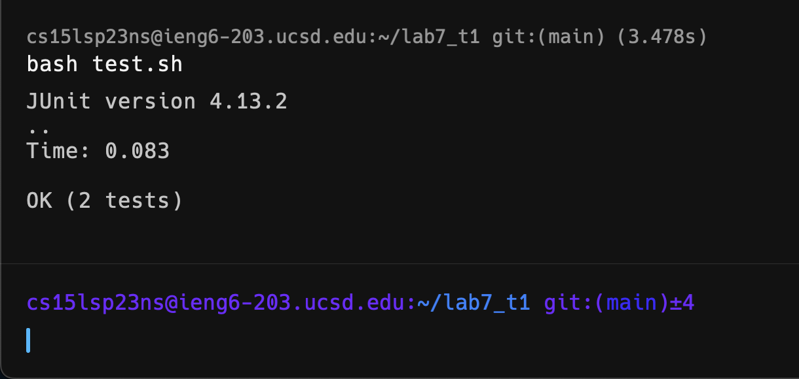

# Daniil Katulevskiy - Lab report 4

## The challenge
1. Setup Delete any existing forks of the repository you have on your account
2. Setup Fork the repository
3. The real deal Start the timer!
4. Log into ieng6
5. Clone your fork of the repository from your Github account
6. Run the tests, demonstrating that they fail
7. Edit the code file to fix the failing test
8. Run the tests, demonstrating that they now succeed
9. Commit and push the resulting change to your Github account (you can pick any commit message!)

## I will show my actions for steps 4-9.

1. Open Github and copy the SSH clone link
2. Open terminal
3. Login to ieng6: `ssh cs15lsp__@ieng6.ucsd.edu`

4. Clone git repo: `git clone git@github.com:__username__/lab7_t1.git`

5. Change directory to the lab: `cd l<tab><enter>`

6. Open file to edit: `nvim L<tab>.java<enter>`

7. Fix the error: `43jf1s2<esc>:wq`

        `43j` got to the 43rd line, where the error is located, 
        `f1` found first symbol 1, `s` deleted the 1 and put me into insert mode, 
        `2` wrote down a 2,
        `<esc>` took me to normal mode, `:wq` saved and exited Vim.

8. Test the program: `bash t<tab><enter>`

9. Add file to commit: `git add L<tab>.j<tab><enter>`

10. Commit the changes: `git commit -m "fix"`

11. Push the changes: `git push`

NOTE: `<tab>` and `<enter>` commands autocomplete the words and run the commands correspondingly.

### The challenge is completed. It took 35 seconds for me to do.

