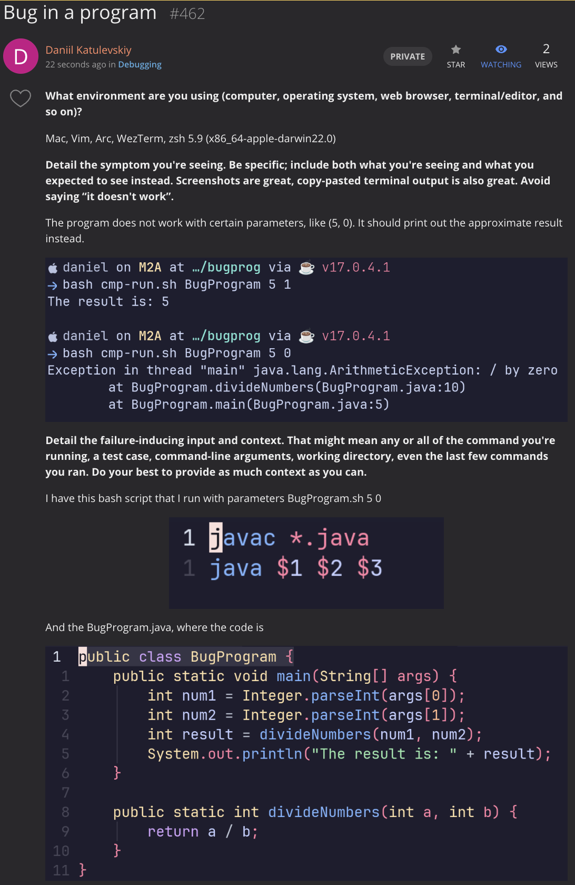
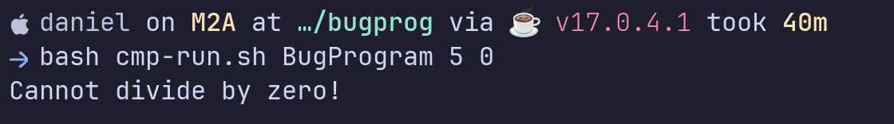
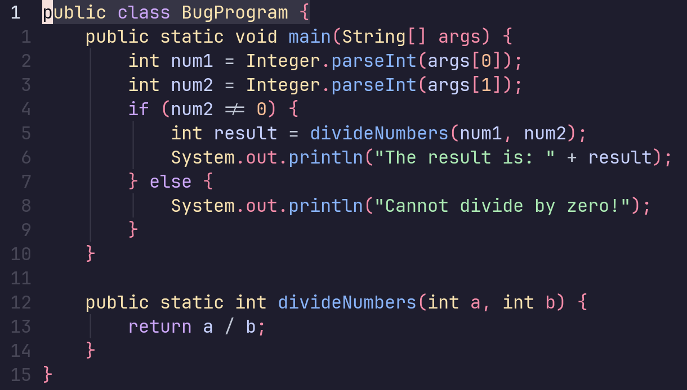

# Lab report 5 - Daniil Katulevskiy A17481234
## Bug report on EdStem


## TA Answer
You have a division by 0 exception. It happens only for certain cases. Hence, try changing the java program code to handle any possible edge cases.

## After the suggested fix

I found the edge case, where there was a division by 0 and handled it with an if statement.  
Fixed code:


## Information
### File and directory structure
All files in one directory.  
Files: BugProgram.java, cmp-run.sh

### Contents of files befor the fix
BugProgram.java
```java

public class BugProgram {
    public static void main(String[] args) {
        int num1 = Integer.parseInt(args[0]);
        int num2 = Integer.parseInt(args[1]);
        int result = divideNumbers(num1, num2);
        System.out.println("The result is: " + result);
    }

    public static int divideNumbers(int a, int b) {
        return a / b;
    }
}


```

cmp-run.sh
```bash

javac *.java
java $1 $2 $3

```

### Contents of files after the fix
BugProgram.java
```java

public class BugProgram {
    public static void main(String[] args) {
        int num1 = Integer.parseInt(args[0]);
        int num2 = Integer.parseInt(args[1]);
        if (num2 != 0) {
            int result = divideNumbers(num1, num2);
            System.out.println("The result is: " + result);
        } else {
            System.out.println("Cannot divide by zero!");
        }
    }
    
    public static int divideNumbers(int a, int b) {
        return a / b;
    }
}


```

cmp-run.sh
```bash

javac *.java
java $1 $2 $3

```

### Command to trigger the bug
`bash cmp-run.sh BugProgram.java 5 0`

### What to edit to fix the bug
Fix the edge case for division when denominator is 0 using an if statement for num2.

## Reflection
I liked working with a remote server. It was a new and interesting experience for me. Hope to do more complex stuff with it further on in other courses.
